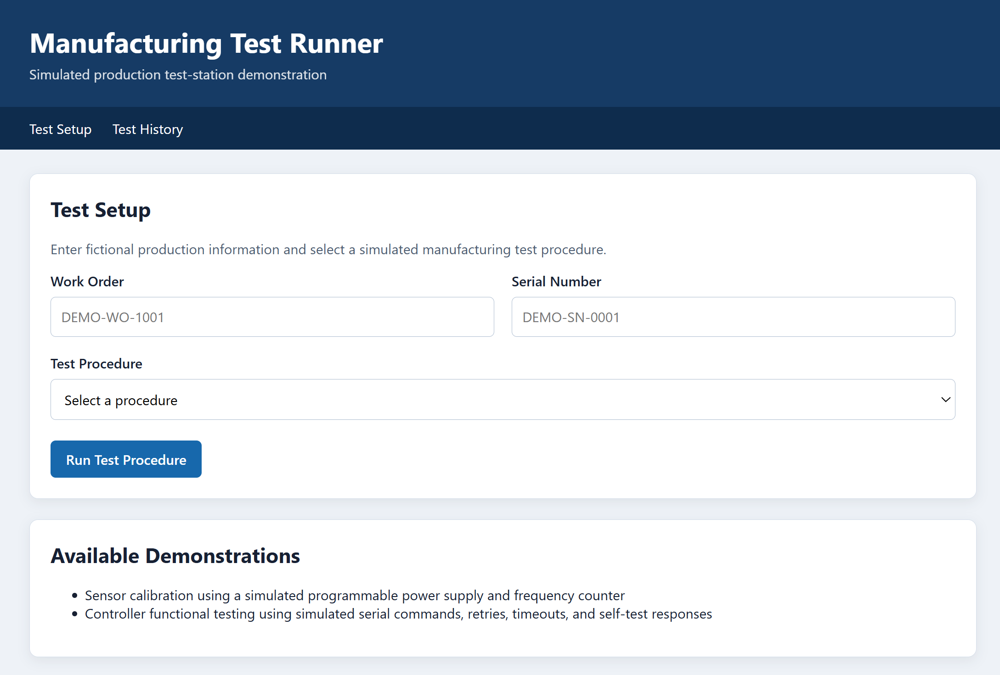
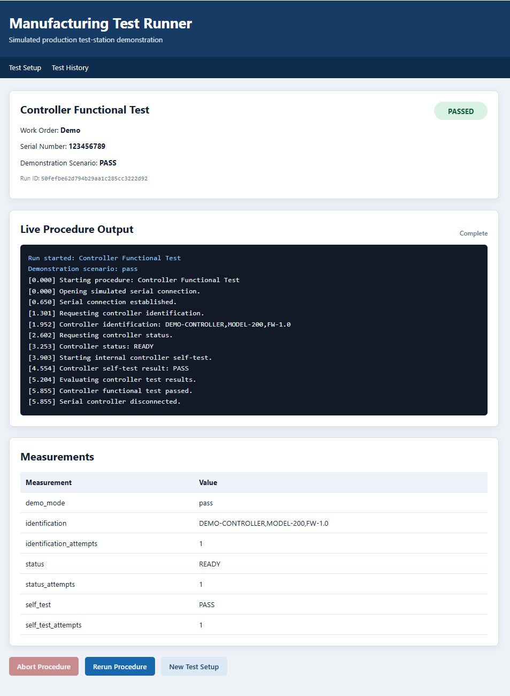
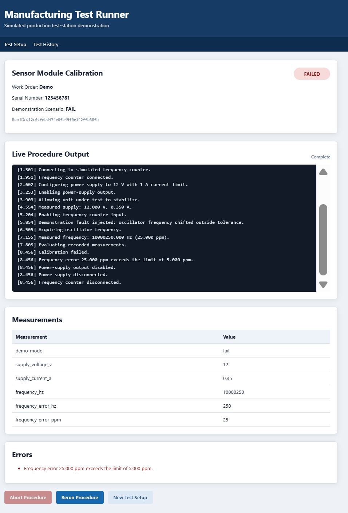
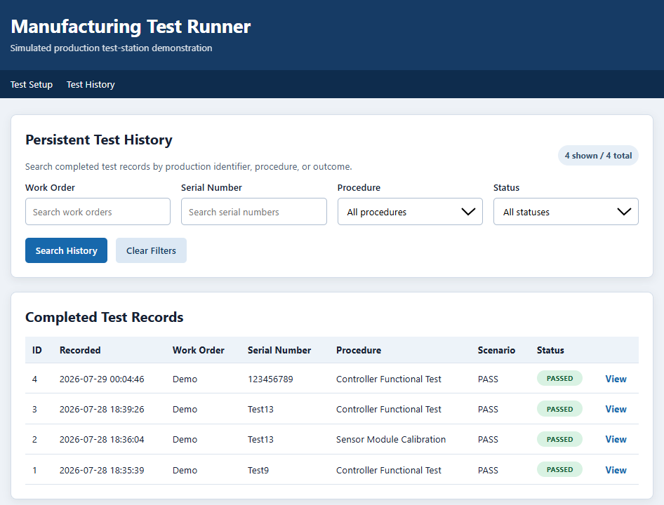
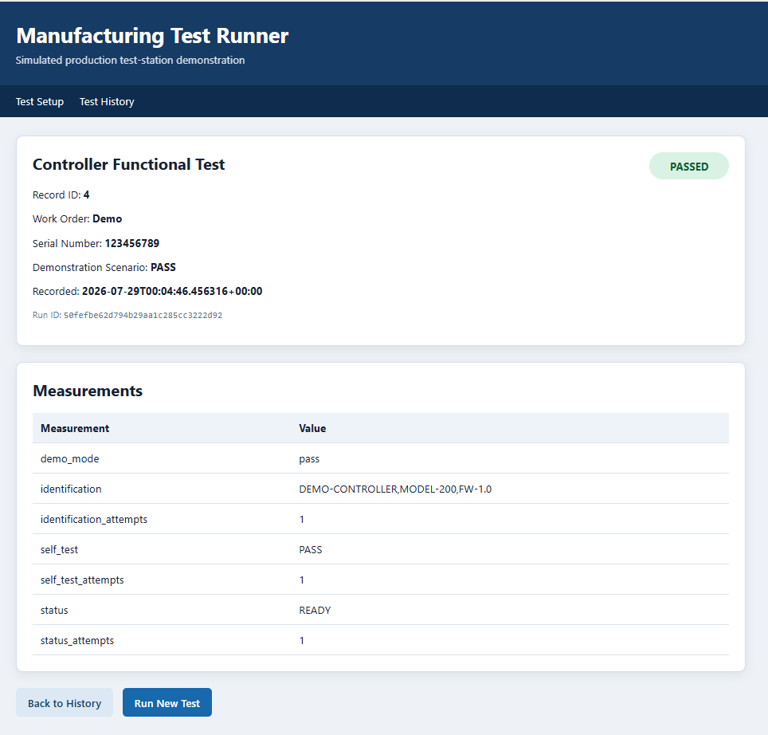

# Manufacturing Test Runner

A portfolio demonstration of a technician-facing manufacturing test application built with Python, Flask, SQLite, JavaScript, and simulated test equipment.

The application models the architecture of a production test station without requiring proprietary hardware, production data, or vendor software. It executes manufacturing procedures, streams live output to the browser, records measurements, handles failures and abort requests, and stores completed results in a searchable SQLite history database.

## Screenshots

### Test Setup



### Live Procedure Execution



### Failed Test Result



### Persistent Test History



### Stored Result Detail



## Application Overview

Manufacturing Test Runner demonstrates how automated test software can convert a complex engineering process into a controlled and repeatable technician workflow.

A technician enters a work order and serial number, selects a procedure and demonstration scenario, and starts the test. The application then:

1. Creates a uniquely identified test run.
2. Executes the selected procedure in a worker thread.
3. Streams live procedure messages to the browser using server-sent events.
4. Coordinates simulated instruments and serial devices.
5. Evaluates measurements against engineering limits.
6. Reports PASS, FAIL, ERROR, or ABORTED status.
7. Performs cleanup even when execution fails or is aborted.
8. Stores the completed result in SQLite.
9. Makes the result available through searchable test history.

## Key Features

* Technician-oriented Flask web interface
* Live procedure output using server-sent events
* Background test execution
* Responsive abort handling
* Rerun support
* Station concurrency protection
* Configurable PASS, FAIL, retry, and timeout scenarios
* Simulated programmable power supply
* Simulated frequency counter
* Simulated serial-controlled device
* Measurement capture
* Engineering-limit evaluation
* Structured procedure results
* Guaranteed resource cleanup
* Persistent SQLite test history
* History filtering by work order, serial number, procedure, and status
* Detailed stored-result views
* Automated unit, integration, route, concurrency, and persistence tests

## Demonstration Scenarios

The setup page includes selectable demonstration scenarios.

### Standard Passing Procedure

Runs the selected procedure with valid simulated measurements and responses.

Expected result:

```text
PASS
```

### Deliberate Test Failure

Injects a simulated fault that causes the selected procedure to fail its engineering checks.

Expected result:

```text
FAIL
```

### Transient Communication Retry

Available for the Controller Functional Test.

The first status command fails, the procedure retries, and communication recovers.

Expected result:

```text
PASS
```

### Communication Timeout

Available for the Controller Functional Test.

The simulated serial device does not return a self-test response before the configured timeout.

Expected result:

```text
ERROR
```

## Demonstration Procedures

### Sensor Module Calibration

The sensor calibration procedure coordinates a simulated programmable power supply and frequency counter.

The procedure:

* Connects to both instruments
* Configures supply voltage and current limit
* Enables power to the simulated unit under test
* Allows the unit to stabilize
* Measures supply voltage and current
* Enables the frequency-counter input
* Measures oscillator frequency
* Calculates frequency error in hertz
* Calculates frequency error in parts per million
* Compares measurements against calibration limits
* Reports the final procedure status
* Disables and disconnects instruments during cleanup

Available scenarios:

| Scenario                   | Expected result                                    |
| -------------------------- | -------------------------------------------------- |
| Standard passing procedure | PASS                                               |
| Deliberate test failure    | FAIL due to oscillator frequency outside tolerance |

### Controller Functional Test

The controller functional test communicates with a simulated serial-controlled device.

The procedure:

* Opens the serial connection
* Requests device identification
* Verifies the expected controller model
* Requests controller status
* Executes the internal self-test
* Supports communication retries
* Simulates timeout behavior
* Evaluates returned responses
* Reports the final procedure status
* Disconnects the serial device during cleanup

Available scenarios:

| Scenario                      | Expected result                |
| ----------------------------- | ------------------------------ |
| Standard passing procedure    | PASS                           |
| Deliberate test failure       | FAIL due to self-test mismatch |
| Transient communication retry | PASS after retry               |
| Communication timeout         | ERROR                          |

## Live Test Execution

Tests execute outside the HTTP request thread.

The `LiveRunManager` creates a background worker thread for each run and publishes structured events as the procedure progresses.

The result page connects to the live event endpoint using the browser `EventSource` API.

Published event types include:

* `run_started`
* `procedure_message`
* `abort_requested`
* `result`
* `execution_error`
* `complete`

This architecture keeps the interface responsive while a long-running manufacturing procedure is active.

## Abort Behavior

An active procedure can receive an abort request from the browser.

Procedure delays are divided into short intervals so abort requests can be detected promptly.

When an abort occurs:

1. The browser submits an abort request.
2. The live run manager forwards the request to the active procedure.
3. The procedure detects the abort during a pause or checkpoint.
4. The result status becomes `ABORTED`.
5. Cleanup still runs.
6. The completed result is stored in history.

## Cleanup Behavior

Cleanup is performed after:

* Passing procedures
* Failed limit evaluations
* Communication failures
* Instrument configuration errors
* Abort requests
* Unexpected exceptions

This models an important manufacturing-test requirement: equipment and communication resources must not remain active after an interrupted or unsuccessful test.

Examples include:

* Disabling power-supply output
* Disconnecting the power supply
* Disabling frequency-counter input
* Disconnecting the frequency counter
* Closing the simulated serial connection

## Persistent Test History

Completed test results are stored in SQLite.

Each record includes:

* Result ID
* Run ID
* Work order
* Serial number
* Procedure ID
* Procedure name
* Demonstration scenario
* Final status
* PASS indicator
* Measurements
* Error messages
* UTC completion timestamp

The history page supports filtering by:

* Work order
* Serial number
* Procedure
* Final status

Measurements and errors are serialized as JSON so procedure-specific data can be stored without requiring a separate schema for every procedure.

## Architecture

```text
Browser
   |
   | HTTP forms, fetch requests, and EventSource
   v
Flask Routes
   |
   +--> LiveRunManager
   |       |
   |       +--> Background worker thread
   |       +--> Server-sent event queue
   |       +--> Active run tracking
   |       +--> Abort forwarding
   |
   +--> ProcedureRunner
   |       |
   |       +--> Station execution lock
   |       +--> Active procedure tracking
   |       +--> Procedure selection
   |       +--> Rerun support
   |
   +--> Manufacturing Procedures
   |       |
   |       +--> SensorCalibrationProcedure
   |       +--> ControllerFunctionalTestProcedure
   |
   +--> Simulated Equipment
   |       |
   |       +--> SimulatedPowerSupply
   |       +--> SimulatedFrequencyCounter
   |       +--> SimulatedSerialDevice
   |
   +--> TestHistoryStore
           |
           +--> SQLite
```

## Project Structure

```text
manufacturing_test_runner/
├── README.md
├── pyproject.toml
├── run.py
├── docs/
│   └── screenshots/
│       ├── failed-test.png
│       ├── history-detail.png
│       ├── live-passing-test.png
│       ├── test-history.png
│       └── test-setup.png
├── src/
│   └── manufacturing_test_runner/
│       ├── __init__.py
│       ├── history_store.py
│       ├── live_runs.py
│       ├── routes.py
│       ├── runner.py
│       ├── procedures/
│       │   ├── __init__.py
│       │   ├── base.py
│       │   ├── controller_functional_test.py
│       │   └── sensor_calibration.py
│       ├── simulators/
│       │   ├── __init__.py
│       │   ├── base.py
│       │   ├── frequency_counter.py
│       │   ├── power_supply.py
│       │   └── serial_device.py
│       ├── static/
│       │   └── css/
│       │       └── app.css
│       └── templates/
│           ├── base.html
│           ├── history.html
│           ├── history_detail.html
│           ├── result.html
│           └── setup.html
└── tests/
    ├── test_history_store.py
    ├── test_procedures.py
    ├── test_routes.py
    ├── test_runner.py
    └── test_simulators.py
```

## Technology Stack

| Technology         | Purpose                                     |
| ------------------ | ------------------------------------------- |
| Python             | Application, simulator, and procedure logic |
| Flask              | Web application and HTTP routing            |
| SQLite             | Persistent test-result storage              |
| HTML               | Technician-facing page structure            |
| CSS                | Interface styling                           |
| JavaScript         | Live result updates and abort requests      |
| Server-Sent Events | One-way live procedure streaming            |
| Threading          | Background execution and station locking    |
| Pytest             | Automated testing                           |
| GitHub Actions     | Continuous integration                      |

## Local Setup

### 1. Clone the repository

```powershell
git clone https://github.com/JustinGottliebEngineering/manufacturing_test_runner.git
cd manufacturing_test_runner
```

### 2. Create a virtual environment

```powershell
python -m venv .venv
```

### 3. Activate the virtual environment

```powershell
.\.venv\Scripts\Activate.ps1
```

### 4. Install the project

```powershell
python -m pip install --upgrade pip
python -m pip install -e ".[dev]"
```

### 5. Run the automated tests

```powershell
python -m pytest -v
```

Current result:

```text
70 passed
```

### 6. Start the application

```powershell
python .\run.py
```

Open:

```text
http://127.0.0.1:5000
```

## Suggested Demonstration

For a complete application walkthrough:

1. Open the Test Setup page.
2. Enter a fictional work order.
3. Enter a fictional serial number.
4. Select Sensor Module Calibration.
5. Select Standard passing procedure.
6. Run the procedure.
7. Observe the live console output.
8. Review the recorded measurements.
9. Rerun the procedure.
10. Return to Test Setup.
11. Select Deliberate test failure.
12. Run the procedure and observe the FAIL result.
13. Select Controller Functional Test.
14. Select Transient communication retry.
15. Observe the retry and recovery.
16. Run the Communication timeout scenario.
17. Start another procedure and press Abort Procedure.
18. Open Test History.
19. Filter by procedure and status.
20. Open an individual stored result.

## Automated Testing

The test suite covers:

* Simulator connection enforcement
* Power-supply configuration
* Power-supply measurement
* Excessive voltage rejection
* Frequency-counter measurements
* Forced frequency readings
* Frequency input validation
* Serial command normalization
* Unsupported serial commands
* Transient communication failures
* Retry exhaustion
* Communication timeouts
* Procedure PASS decisions
* Procedure FAIL decisions
* Procedure ERROR handling
* Procedure message callbacks
* Instrument cleanup
* Setup errors
* Procedure selection
* Station concurrency protection
* Abort requests
* Rerun behavior
* Flask form validation
* Live result pages
* Server-sent event output
* Persistent history storage
* Duplicate run protection
* History filtering
* Stored-result retrieval
* Unknown run handling
* Unknown history-record handling

Run the suite with:

```powershell
python -m pytest -v
```

## Continuous Integration

The repository is configured to run automated tests through GitHub Actions.

The workflow verifies the application on pushes and pull requests.

Continuous integration protects:

* Procedure logic
* Equipment simulators
* Flask routes
* Live execution
* Concurrency behavior
* Persistence
* History filtering

## Engineering Concepts Demonstrated

This project demonstrates patterns used in manufacturing test systems:

* Separation of web, orchestration, procedure, and equipment layers
* Abstract equipment interfaces
* Deterministic hardware simulation
* Procedure-specific measurement limits
* Resource ownership
* Guaranteed cleanup
* Background execution
* Live technician feedback
* Cooperative cancellation
* Station-level concurrency control
* Structured result records
* Persistent traceability
* Failure injection
* Automated regression testing

## Portfolio Context

This is a standalone portfolio project built with fictional identifiers and simulated equipment.

It does not contain:

* Employer source code
* Proprietary test procedures
* Production credentials
* Customer information
* Product firmware
* Confidential manufacturing data
* Vendor-restricted documentation

The project is intended to demonstrate software architecture, manufacturing-test automation, equipment coordination, test traceability, and technician-interface design using independently written code.

## Future Enhancements

Potential future additions include:

* CSV result export
* PDF test reports
* Technician authentication
* Role-based access
* Procedure revision tracking
* Configurable database-backed limits
* Barcode-scanner input
* Equipment calibration status tracking
* REST API endpoints
* Bidirectional WebSocket communication
* Production deployment configuration
* Additional simulated instruments
* Additional manufacturing procedures
